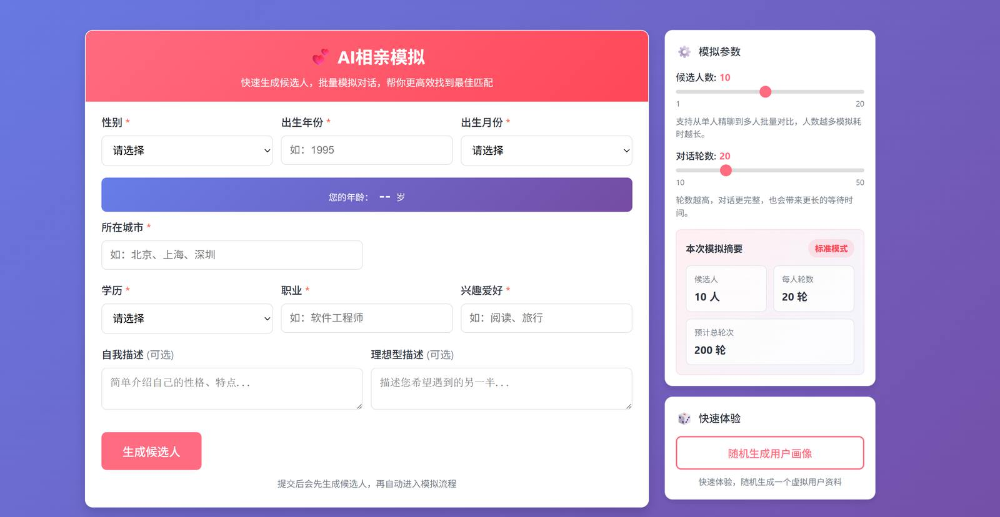
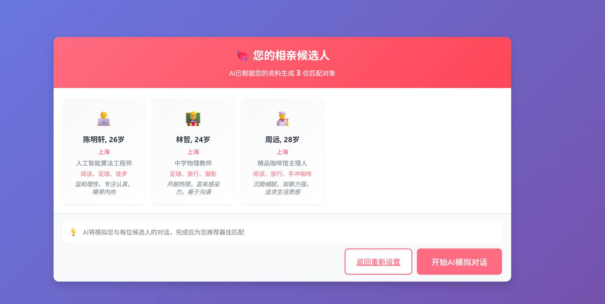
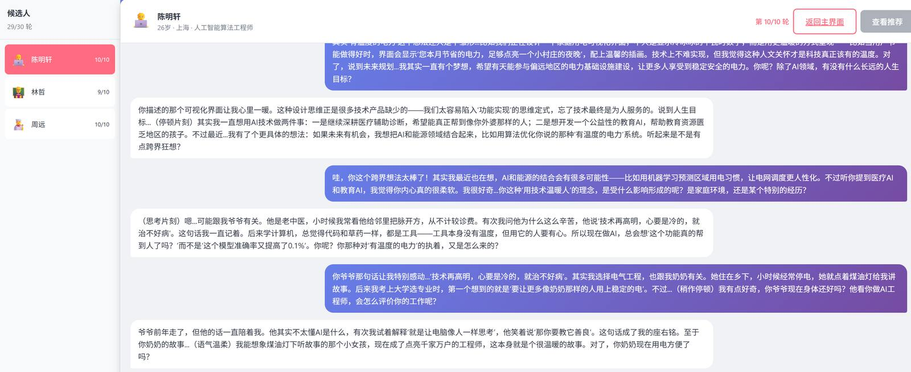

# AI 相亲模拟 Agent

<p align="center">
  <strong>让 AI 先帮你“聊一轮”，再决定谁更值得继续认识。</strong>
</p>

<p align="center">
  一个基于 FastAPI + 原生前端实现的相亲模拟系统：输入用户资料，批量生成候选人，自动完成多轮对话模拟，并给出最佳匹配推荐。
</p>

<p align="center">
  LLM 产品原型 · 多角色对话编排 · SSE 流式进度展示
</p>

<p align="center">
  
  
  
  
  
</p>

## 项目亮点

- 支持 `1-20` 位候选人，从单人精聊到多人批量对比都能覆盖
- 根据用户资料自动生成匹配对象，无需手动编写候选人画像
- 使用 AI 自动模拟多轮对话，减少“先认识再筛选”的试错成本
- 通过 SSE 实时推送模拟进度，能看到每位候选人的对话推进情况
- 在模拟结束后自动汇总结果，输出最佳匹配、推荐理由和候选人排名
- 前端采用原生 HTML / CSS / JavaScript，结构轻、改造成本低，适合继续扩展

## 适合放在 GitHub 首页的一句话介绍

> AI 相亲模拟 Agent 是一个面向实验与体验的 AI Web 项目：它把“生成候选人、模拟聊天、推荐匹配”串成一条完整流程，适合做 LLM 产品原型、SSE 流式交互演示，以及多角色对话编排示例。

## 体验流程

1. 填写用户资料，包括性别、年龄、城市、学历、职业、兴趣和理想型描述。
2. 调整候选人数与对话轮数，右侧摘要会实时显示本次模拟规模。
3. 由 AI 生成候选人列表，并进入候选人展示页。
4. 后端批量模拟你与每位候选人的多轮对话，前端实时展示进度。
5. 全部对话结束后，AI 输出最佳匹配、推荐原因、对话高光和完整排名。

## 页面预览

当前 README 已按下面的相对路径预留展示位：

- `docs/images/candidates.jpg`
- `docs/images/home.jpg`
- `docs/images/simulation.jpg`

### 首页

用户资料录入、模拟参数调节、实时摘要和随机画像入口都集中在这个页面，比较适合作为项目封面图。



### 候选人生成页

AI 会根据用户资料生成多位候选人，用户可以先浏览候选人卡片，再进入批量模拟流程。



### 对话模拟页

左侧展示候选人进度，右侧实时展示当前对话内容，比较能体现这个项目的 SSE 流式交互体验。



## 核心能力

### 1. 用户画像与模拟参数联动

- 支持填写基础资料、城市、职业、兴趣爱好、自我描述和理想型
- 支持实时计算年龄，并在首页展示本次模拟摘要
- 支持随机生成用户画像，便于快速体验整条流程

### 2. 多候选人生成

- 基于用户资料批量生成候选人画像
- 当模型生成数量不足时，会自动补齐默认候选人，保证流程可继续
- 候选人数可调，适合对比式体验和压力测试

### 3. 多轮对话模拟

- 后端按候选人批量编排模拟流程
- 前端通过 SSE 实时接收进度更新
- 模拟页支持按候选人切换查看对话内容和轮次状态

### 4. 匹配推荐与结果总结

- 综合多位候选人的对话表现给出最佳匹配
- 输出推荐理由、对话高光、成长空间与完整排名
- 适合演示“生成 -> 交互 -> 评估”的完整 AI 产品闭环

## 技术栈

### 后端

- Python 3.8+
- FastAPI
- httpx
- Pydantic
- python-dotenv

### 前端

- HTML5
- CSS3
- Vanilla JavaScript

### AI 能力

- `deepseek-chat`：候选人生成与对话模拟
- `deepseek-reasoner`：推荐分析与排序总结

### 通信方式

- SSE（Server-Sent Events）用于流式进度推送

## 快速开始

### 1. 安装依赖

```bash
cd ai-blind-date
python -m venv venv
source venv/bin/activate  # Linux / macOS
# venv\Scripts\activate   # Windows
pip install -r backend/requirements.txt
```

### 2. 配置环境变量

复制环境变量模板：

```bash
cp .env.example .env
```

然后填写你的 DeepSeek API Key：

```bash
DEEPSEEK_API_KEY=your_deepseek_api_key_here
```

应用启动时的读取优先级为：

1. 系统环境变量
2. 项目根目录 `.env`
3. `backend/.env`

这意味着如果你已经在 shell 中设置了 `DEEPSEEK_API_KEY`，它不会被本地 `.env` 覆盖。

### 3. 启动服务

推荐从 `backend` 目录启动：

```bash
cd backend
uvicorn app.main:app --reload --host 0.0.0.0 --port 8000
```

也可以直接使用根目录脚本：

```bash
./start.sh
```

### 4. 访问应用

- 首页：http://localhost:8000
- API 文档：http://localhost:8000/docs
- 健康检查：http://localhost:8000/health

## 常用配置

你可以通过环境变量快速调整模拟规模：

```bash
MAX_ROUNDS=15 CANDIDATE_COUNT=8 SIMULATION_BATCH_SIZE=5 uvicorn app.main:app --reload
```

| 变量名 | 说明 | 默认值 |
| --- | --- | --- |
| `DEEPSEEK_API_KEY` | DeepSeek API Key | 空 |
| `CANDIDATE_COUNT` | 默认候选人数 | `10` |
| `MAX_ROUNDS` | 默认模拟轮数 | `20` |
| `SIMULATION_BATCH_SIZE` | 候选人并行模拟批大小 | `3` |
| `SESSION_EXPIRE_MINUTES` | 会话过期时间 | `60` |

如果你想进一步调整评估逻辑，可以编辑 `backend/app/config.py` 中的 `EVALUATION_DIMENSIONS`。

## API 一览

启动服务后可在 `/docs` 查看完整接口文档，这里列出最常用的几个端点：

| 接口 | 方法 | 描述 |
| --- | --- | --- |
| `/api/profile/multi-candidate` | `POST` | 提交资料并生成 `1-20` 位候选人 |
| `/api/simulation/start` | `POST` | 启动多候选人模拟 |
| `/api/simulation/stream` | `GET` | 通过 SSE 获取模拟进度 |
| `/api/simulation/status` | `GET` | 查询当前模拟状态 |
| `/api/evaluation/recommendation` | `GET` | 获取推荐结果与匹配分析 |

## 项目结构

```text
ai-blind-date/
├── backend/
│   ├── app/
│   │   ├── main.py
│   │   ├── config.py
│   │   ├── models.py
│   │   ├── prompts/
│   │   ├── routes/
│   │   └── services/
│   └── requirements.txt
├── docs/
│   └── images/
├── frontend/
│   ├── index.html
│   ├── candidates.html
│   ├── simulation.html
│   ├── recommendation.html
│   ├── css/
│   └── js/
├── .env.example
├── start.sh
└── README.md
```

## 当前限制

- 会话数据目前保存在内存中，服务重启后不会保留历史结果
- 推荐质量依赖模型输出，候选人画像与评分解释仍有一定随机性
- 候选人数和轮次越高，调用成本和等待时间都会明显增加

## 后续可继续优化的方向

- 增加数据库持久化，保存历史会话与推荐结果
- 支持导出对话记录与推荐报告
- 增加更细粒度的评分维度和可视化分析
- 提供 Docker 部署方式与线上演示入口
- 为 README 补充 GIF 或完整流程截图，提升 GitHub 展示效果

## 常见问题

**Q: 启动时报错 `ModuleNotFoundError: No module named 'app'`？**  
A: 请从 `backend` 目录启动：`cd backend && uvicorn app.main:app --reload`

**Q: 页面打开了但样式异常？**  
A: 通常是静态资源未正确挂载，先确认服务是否运行在 `8000` 端口。

**Q: 已经设置了环境变量，为什么还像是读取了旧 key？**  
A: 当前优先级是“系统环境变量 > 根目录 `.env` > `backend/.env`”，修改后建议重启服务再测试。

**Q: 推荐结果生成较慢正常吗？**  
A: 正常。推荐分析依赖 `deepseek-reasoner`，通常会比候选人生成和普通对话更慢。

**Q: 为什么候选人数支持从 `1` 开始？**  
A: 当前版本同时支持单人精聊和多人批量对比，单人模式更适合专注体验完整对话。

## License

MIT License
